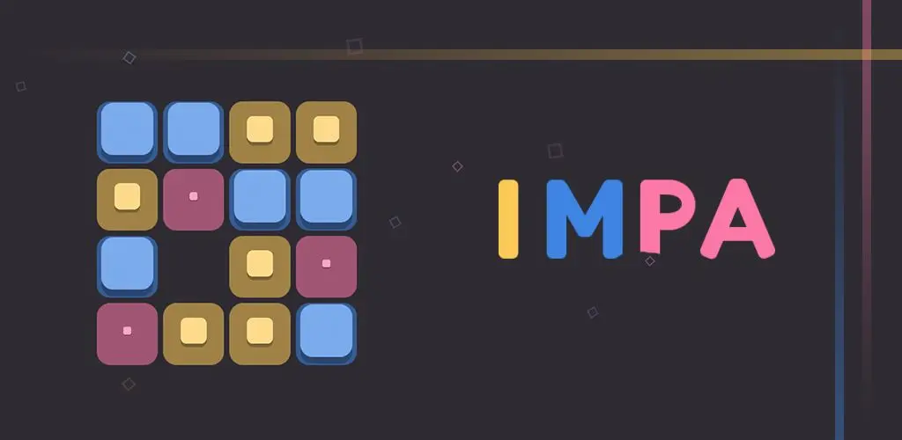

# IMPA
PyGame implementation of IMPA game from [TapTap](https://www.taptap.cn/app/171019).
The core game logic is implemented with C++ for effecient reinforcement learning.

# Run
Just run main.py with Python3. The C++ code will be compiled JIT.

# Play Note
- Game Target: Just as the figure above. Make Red block minimal, Yellow block in middle and Blue block biggest.
- Click **Red Circle** to reset, **Yellow Circle** to next level (Only appears when target achieved).
- Diffculty: I use 14 hours to finish all 80 levels.
- The program will save your process automatically.
